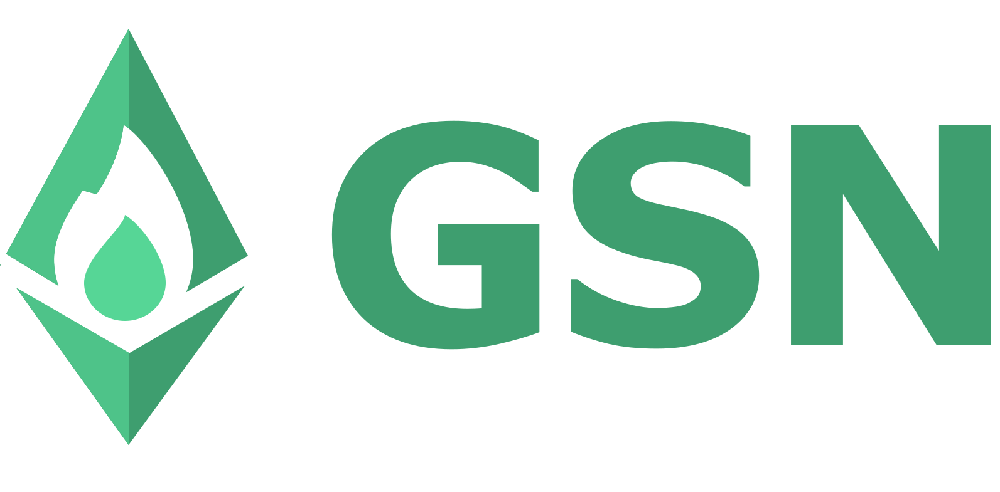

<div>
  &nbsp;
  &nbsp;
  &nbsp;
  &nbsp;
  &nbsp;
</div>

[](https://app.circleci.com/pipelines/github/opengsn/gsn?branch=master)


[](https://bundlephobia.com/package/@opengsn/provider)
[](https://bundlephobia.com/package/@opengsn/provider)
# The Ethereum Gas Stations Network

[](http://discord.gg/b5Jk9kWcPG)

## What is GSN?
[GSN](https://opengsn.org/) is a distributed network of transaction relayers that allows decentralized
applications (daps) to abstract away the process of paying the transaction gas fees to minimize friction during
new user onboarding and to improve the user experience. With GSN, gasless clients can interact with Ethereum contracts
without users needing to own or spend ETH for transaction fees.

<div id="header" align="center">
  
</div>

## Architecture Overview
The GSN has a reasonably simple architecture. You should have a basic understanding of what components the GSN project
consists of before you can integrate it into your Dapp.

The GSN consists of three major components working together: Relay Server, Relay Provider, and GSN Smart Contracts.
The Dapp that wants to integrate the GSN has two smart contracts to support the alternative gas payment logic:
Paymaster and Relay Recipient.

#### Relay Server
The Relay Server is a Node.js server that accepts Relay Requests and broadcasts them as transactions to the blockchain.
It controls a Relay Worker account key and pays for transaction gas out-of-pocket. It is the GSN Smart Contract's job
to make sure the Relay Server is getting its money back at the end of the transaction.

#### Relay Provider
The Relay Provider is a Node Module written in TypeScript that can wrap your Ethereum provider (Web3.js, Ethers.js,
MetaMask, WalletConnect, etc.) and route all outgoing transactions through the GSN.

#### GSN Smart Contracts
All contracts that form the core of the GSN are supposed to be singletons on each network.
Note: Deploying your own GSN contracts is possible, but that creates a separate GSN network.

##### RelayHub
The RelayHub is the main contract in the GSN. It connects users running clients, relay servers, and paymasters so that
participants don't need to know or trust each other.

##### Forwarder
The Forwarder contract verifies the sender's signature and nonce.
The Recipient contracts only rely on a small trusted forwarder contract for their security.

#### Paymaster and Recipient
As sending a transaction on the Ethereum network costs the Relay Server some real money, it has to be compensated.
In the most basic scenario, it is the Dapp developers who will have to subsidize their users' transactions.
In such a case, a decentralized application using GSN has to implement a contract called Paymaster.
This contract keeps an amount of Ether as its own balance in the RelayHub and is charged for the transaction afterward.

The target contract to which the original transaction was made is called Recipient.
It has to inherit from the `ERC2771Recipient` base contract in order to support being called through the GSN.

## Installation and Usage

In order to install the GSN client library
```bash
yarn add @opengsn/provider
```

Using it within your application:
```JavaScript
const { RelayProvider } = require('@opengsn/provider')

// Create a new RelayProvider instance in the place where you normally initialize your Web3.js/Ethers.js provider:
async function getProvider() {
  const config = {
    paymasterAddress,
    loggerConfiguration: {
      logLevel: 'debug'
    }
  }
  // to create a Web3.js Provider object:
  const gsnProvider = await RelayProvider.newWeb3Provider({ provider: window.ethereum, config })
  // to create a pair of Ethers.js Provider and Signer:
  const { gsnProvider, gsnSigner } = await RelayProvider.newEthersV5Provider({ provider: new JsonRpcProvider(url), config})
}
```
> **_NOTE:_**   You can pass `window.ethereum`, Web3.js Provider, Ethers.js Signer or Provider (both v5 or v6), in the `provider` parameter.<br/>
> Use `newEthersV5Provider` or `newEthersV6Provider` instead of `newWeb3Provider` to create a pair of Ethers.js Provider and Signer.<br/>
> You can also connect a single `ERC2771Recipient` contract like this: ``` const gsnContract = await connectContractToGSN(contract, config) ```

Adding `ERC2771Recipient` to your target smart contract:
```solidity
import "@opengsn/contracts/src/ERC2771Recipient";

contract MyContract is ERC2771Recipient {
    constructor(address forwarder) {
        _setTrustedForwarder(forwarder);
    }

    /* the rest of your contract code */
}
```
## Developing a Paymaster contract
The GSN cannot predict the exact logic your project needs to implement to decide whether you want to pay for
the transaction or not. We provide some sample Paymaster, but the Paymaster is a part of your application and
the samples provided by the GSN team may or may not fit your use case.

Here are some of our sample Paymasters:

### [AcceptEverythingPaymaster](https://github.com/opengsn/gsn/blob/master/packages/paymasters/contracts/AcceptEverythingPaymaster.sol)
This is only a viable approach for testing and will be immediately drained on a real network.

### [WhitelistPaymaster](https://github.com/opengsn/gsn/blob/master/packages/paymasters/contracts/WhitelistPaymaster.sol)
This Paymaster allows you to specify an array of senders, targets, and methods that will be subsidized by it.

### [Token + Permit + Uniswap Paymaster](https://github.com/opengsn/gsn/blob/19ca9a91255986cf45d330f8b1c313c8d4ebd020/packages/paymasters/contracts/PermitERC20UniswapV3Paymaster.sol)
There is no single approach to making transactions be paid for in ERC-20 tokens.
This Paymaster uses a combination of the ERC-2612 `permit` method and a Uniswap v3 to charge users with tokens.<br>

## Running a Relay Server
Everyone is allowed to join the GSN and act as a Relay Server and it is a fairly simple process.
We provide a `docker-compose` script to do so and the tutorial explaining how to join with a simple cloud
virtual machine instance can be found here:<br>
https://docs.opengsn.org/relay-server/tutorial.html

## Active deployments
A full list of the networks with active GSN deployments can be found here:

For GSN v3:<br>
https://docs.opengsn.org/networks/addresses.html

For GSN v2:<br>
https://docs-v2.opengsn.org/networks/addresses.html

Also, you can see registered relays and deployments on dashboard pages.

For GSN v2:<br>
https://relays-v2.opengsn.org/

For GSN v3:<br>
https://relays.opengsn.org/

## FAQ
A full list of FAQs can be found here:<br>
https://docs.opengsn.org/faq/general.html

#### Should dapp developers run their own relay server?
Running a relay server is highly recommended for most use cases.
It will usually save money for dapps to run their own relays.
This way they can avoid having to pay an extra transaction fee to a third party.
Only if the dapp's preferred relay server is unavailable, the clients will seamlessly fall back to another
relayer in the network. This protects against network failures and denial of service attacks.
If a preferred relayer is not configured, all transactions will be routed through third-party relay servers.

#### We already have our smart contracts deployed. Can we add support for the GSN without redeploying?
Generally speaking, integration with the GSN requires a small modification to the target smart contract to become a
functional Relay Recipient. However, if your smart contracts support a different meta-transactions mechanism, they might
be able to piggyback on the GSN without a need to modify your code.

#### Can users who have no Ether transfer ERC-20 tokens with GSN?
Only ERC-20 tokens that also support the ERC-2612 `permit` method can be used gaslessly. The basic ERC-20 standard does not
include any support for meta-transactions and requires at least a single call to `approve` method to be paid by the sender.

## Resources

* [GSN documentation](https://docs.opengsn.org/)
* [GSN Discord Server](http://discord.gg/b5Jk9kWcPG)

### On GitHub

* [GSN + Ethers + React + Vite - minimal viable sample](https://github.com/opengsn/react-vite-ethers-gsn-demo)
* [GSN example integration](https://github.com/opengsn/workshop)

## Live demo

Make a transaction and capture the flag on-chain without paying for gas. [Try it now!](https://ctf-react.opengsn.org/)
